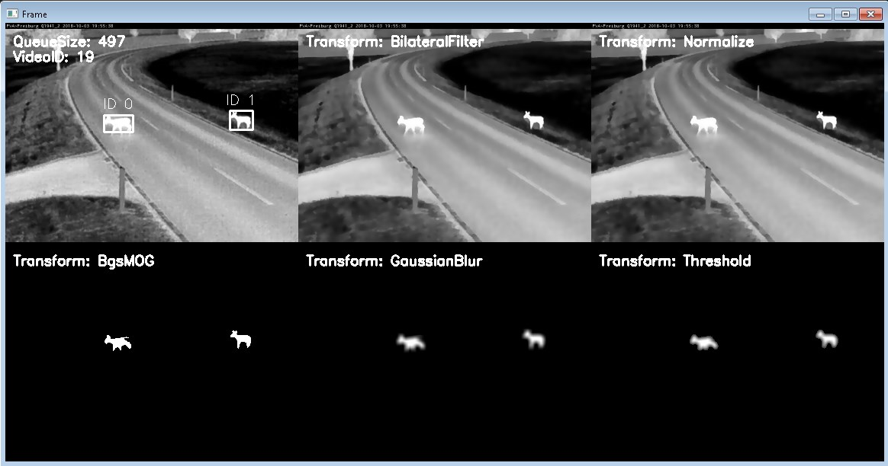

# CamTrapPy

A software to analyse video data from thermal cameras in Python.
Later versions might also support picture data.

## Development

### Setup

It's best to use `Anaconda` or `miniconda`. To setup your environment run `conda env -f environment-dev.yml`. To update your environment after changing the requirements in the environment file run `conda env update -f environment-dev.yml --prune`. The `prune` command will remove modules that were deleted from the environment file.

For meaningful version management of notebooks the module `nbdime` is used. Git-integration is achieved with `nbdime config-git --enable --global`.

### Version management

`nbdiff notebook1.ipynb notebook2.ipynb` compares two notebooks.

`nbdiff-web` does the same but also shows rich content like images.
